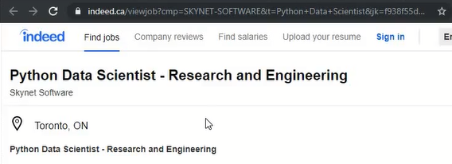
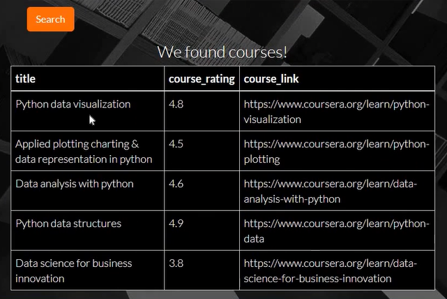
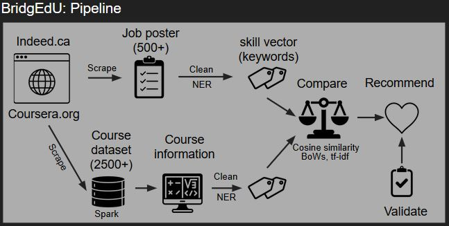
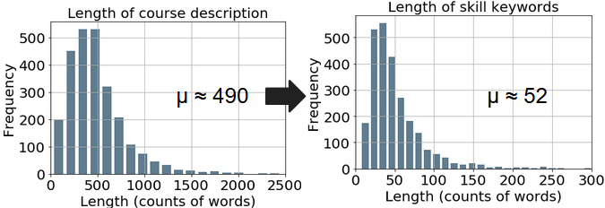
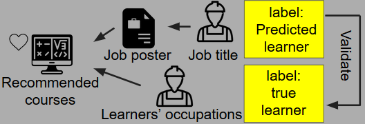

# BridgEdU
> Bridge you and your next job by online education resources

## Table of Contents
- [Motivation](#Motivation)
- [Features](#Features)
- [Pipeline](#Pipeline)
- [Dependencies](#Dependencies)
- [Components](#Components)
# Motivation
Because of the automation of the traditional industry, workers are undergoing job transitions. According to a recent report, about 40 to 50 percent of jobs in developed countries are at high risk of change. Up to 400 million workers must find their next job opportunities in the future. Job transition is a painful process. When browsing job posters, there are always a bunch of skill requirements, and we have to acquire new skills to get the next job. One of the popular ways to get new skills is by taking MOOC (Massive Open Online Course). However, MOOC resources are overwhelming, so we will spend time and money to figure out the fittest courses for that position. To find courses based on the job poster easier, I developed BridgEdU.
  
The online course recommendation system was deployed as a web-app using Flask framework on AWS EC2, 
# [BridgEdU](http://sorbite.xyz:5000).

# Features
1. In the input box, users can paste the link of job posters from [Indeed.ca](http://indeed.ca) and [Linkedin.ca](http://linkedin.ca).
  

  
2. BridgEdU can fetch the job poster from the link inputted, scrape the content, and extract the skills and compare the skills with courses provided by [Coursera.org](http://Coursera.org) in the backend.
  
3. BridgEdU will recommend 5 courses for the job poster inputted by users.
  

  
4. If a user doesn't input anything and click the search button, BridgEdU will return 5 random courses using keywords, such as 'social', 'music', 'sport', 'health', and so on.
  
5. If a user input an invalid link of the job poster, BridgEdU will ask the user to check the link.
# Pipeline

### The figure above is a snapshot of my analysis pipeline behind BridgEdU.
* __Scrape websites__: the start point is web scraping. The course information is from [Coursera.org](http://Coursera.org) and job posters are from [Indeed.ca](http://indeed.ca). Python packages, including Selenium and BeautifulSoup, are used to scrape the data and structure the scraped data.
  
* __Save dataset__: the cleaned course information was saved to Spark dataframe and registered as a table. Though at this stage, the amount of data is not necessary to use Spark framework, the pipeline is readily scalable by adding more online education resources, not limited from [Coursera.org](http://Coursera.org).
  
* __Extract skill vectors__: the skill vectors are the keywords of skills mentioned in the job posters and course description. Named Entity Recognition (NER) was applied to extract the skill keywords in both job posters and course information. Pretrained models (from spacy) were further trained using 200 skill-labelled job posters (from DataTurks). A pre-trained model that can detect 57.4% skill keywords as entities. After trained the model with an additional job poster training set, the performance was elevated to 83.9%. Following this step, the entities were extracted and cleaned to have skill vectors, validated by the test set from DataTurks.
  
* __Recommend courses__: once I get the skill vectors, I compare the cosine similarity between inputted job poster and course description in the dataset. Cosine similarity scores were assigned to the courses to represent the similarity between the courses and job posters. The approach has the advantage to reduce the number of words when making a comparison. The number of words was 10 times fewer (Figure below), so it is less computationally intensive and is in favor of scaling and deploying as a web-app.

  
* __Validate the recommended courses__: the recommendation system was validated by relevancy between the course recommended and the job poster inputted, by comparing true learner label and suggested learner label assigned to recommended courses. The overall accuracy of the top 5 courses recommended on the test set of job posters is 94.1%. Another validation approach I would like to implement will be A/B testing, to check the enrollment rate of recommended courses.
  

# Dependencies
* Python 3
* Python [packages](utilities/requirements.txt)
# Components
### All the components in the package 'utilities' for BridgEdU are listed.
__ScrapeIndeed__: scrapes job posters from indeed.ca. Job posters, including titles with 'Graphic Designers', 'Data Scientist', 'Security Engineer', 'Pharmacist', 'Marketing Specialist', 'Business Analyst', 'Accountant', 'Customer Care Rep', 'Biologist', 'Librarian', 'Entrepreneur', 'Teacher', and 'Photographer' were scraped.
  
__ScrapeCoursera__: scrapes all course information ('course links', 'course titles', and 'course syllabus') from Coursera.org.
  
__CleanIndeedDataset__: cleans and wrangles scraped job posters using nltk.
  
__CleanCourseraDataset__: cleans and wrangles scraped course information using nltk.
  
__PreprocessDataset__: processes job posters and course descriptions. After this step, the contents of both are ready to apply NER.
  
__SaveSpark__: saves the course collection as Spark dataframe. 
  
__TrainENR__: coverts dataset to spacy training set and trains the NER model with customized labels.
  
__Recommend__: processes user input and extracts skill vectors of the job poster. Calculates the cosine similarity between job skill vector and course skill vectors. Lists the most similar courses according to the inputted job poster.
  
__Validate__: computes the overall accuracy of the top 5 recommended courses from Coursera.org using the test set with scraped job posters.
  
__app__: runs the core components of BridgEdU web-app.

